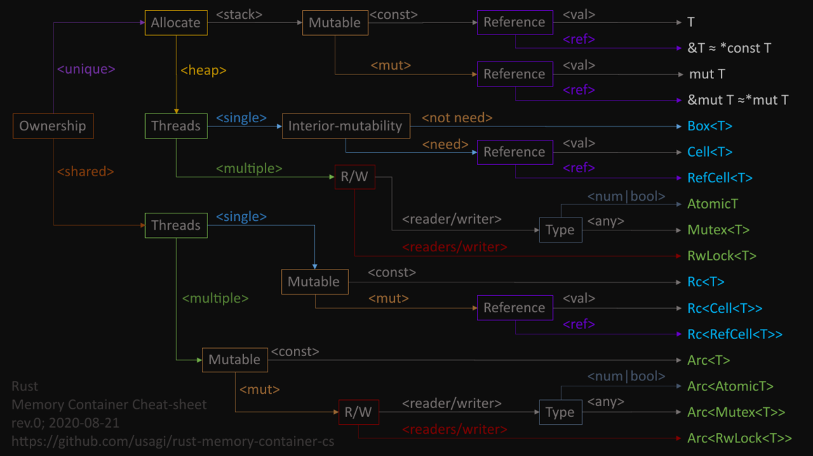

* [Rust のメモリーコンテナー的な何かをわかりやすく整理したチートシートのメモ; T, Cell, RefCell, AtomicT, Mutex, RwLock, Rc, Arc](https://usagi.hatenablog.jp/entry/2020/08/22/040059)
  * [Rust Memory Container Cheat-sheet](https://qiita.com/usagi/items/fc329895cebd3466910e)

